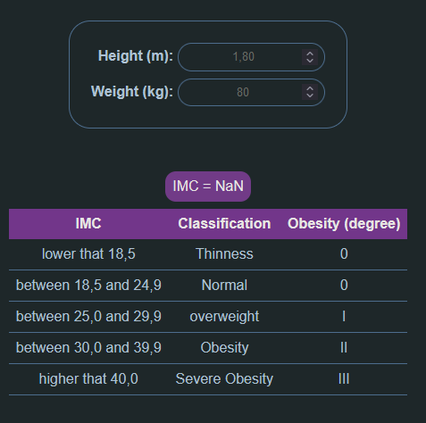

# Project Title

## Table of Contents

- [About](#about)
- [Getting Started](#getting_started)
- [Usage](#usage)
- [Contributing](../CONTRIBUTING.md)

## About <a name = "about"></a>

A basic usage from de React using Vise to build.

## Getting Started <a name = "getting_started"></a>

These instructions will get you a copy of the project up and running on your local machine for development and testing purposes.

### Installing

A step by step series of examples that tell you how to get a development env running.

Say what the step will be

```
npm install
```

Development Server

```
npm run dev
```


## Usage <a name = "usage"></a>

